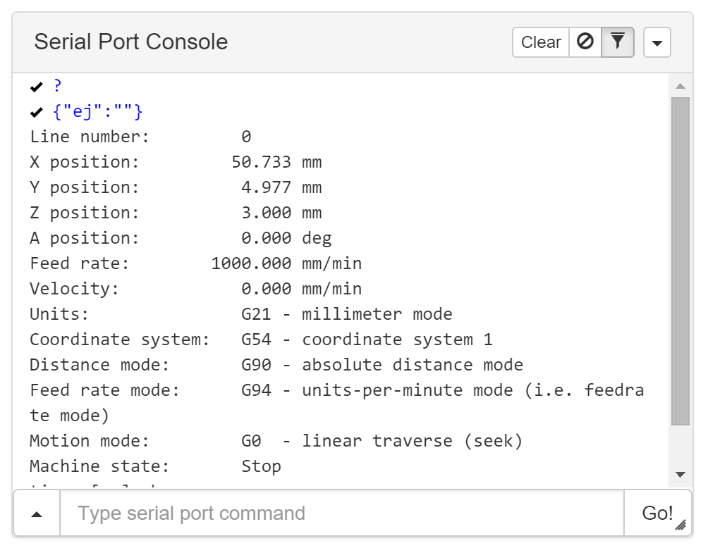

# com-chilipeppr-widget-spconsole
The Console widget lets you see the serial port log as well as send serial port commands into the selected serial port in the SPJS widget (the green one). There is a filter feature you can toggle in case your serial device sends large amounts of data that can overwhelm the user, but that you occasionally want to view by toggling the funnel. The console also lets you jump to previous commands using the up/down arrows in the input textbox.



## ChiliPeppr Widget / Serial Port Console v1.7

All ChiliPeppr widgets/elements are defined using cpdefine() which is a method
that mimics require.js. Each defined object must have a unique ID so it does
not conflict with other ChiliPeppr widgets.

| Item                  | Value           |
| -------------         | ------------- | 
| ID                    | com-chilipeppr-widget-spconsole |
| Name                  | Widget / Serial Port Console v1.7 |
| Description           | The Console widget lets you see the serial port log as well as send serial port commands into the selected serial port in the SPJS widget (the green one). There is a filter feature you can toggle in case your serial device sends large amounts of data that can overwhelm the user, but that you occasionally want to view by toggling the funnel. The console also lets you jump to previous commands using the up/down arrows in the input textbox. |
| chilipeppr.load() URL | http://raw.githubusercontent.com/chilipeppr/widget-console/master/auto-generated-widget.html |
| Edit URL              | http://ide.c9.io/chilipeppr/widget-console |
| Github URL            | http://github.com/chilipeppr/widget-console |
| Test URL              | https://preview.c9users.io/chilipeppr/widget-console/widget.html |

## Example Code for chilipeppr.load() Statement

You can use the code below as a starting point for instantiating this widget 
inside a workspace or from another widget. The key is that you need to load 
your widget inlined into a div so the DOM can parse your HTML, CSS, and 
Javascript. Then you use cprequire() to find your widget's Javascript and get 
back the instance of it.

```javascript
// Inject new div to contain widget or use an existing div with an ID
$("body").append('<' + 'div id="myDivWidgetSpconsole"><' + '/div>');

chilipeppr.load(
  "#myDivWidgetSpconsole",
  "http://raw.githubusercontent.com/chilipeppr/widget-console/master/auto-generated-widget.html",
  function() {
    // Callback after widget loaded into #myDivWidgetSpconsole
    // Now use require.js to get reference to instantiated widget
    cprequire(
      ["inline:com-chilipeppr-widget-spconsole"], // the id you gave your widget
      function(myObjWidgetSpconsole) {
        // Callback that is passed reference to the newly loaded widget
        console.log("Widget / Serial Port Console v1.7 just got loaded.", myObjWidgetSpconsole);
        myObjWidgetSpconsole.init();
      }
    );
  }
);

```

## Publish

This widget/element publishes the following signals. These signals are owned by this widget/element and are published to all objects inside the ChiliPeppr environment that listen to them via the 
chilipeppr.subscribe(signal, callback) method. 
To better understand how ChiliPeppr's subscribe() method works see amplify.js's documentation at http://amplifyjs.com/api/pubsub/

  <table id="com-chilipeppr-elem-pubsubviewer-pub" class="table table-bordered table-striped">
      <thead>
          <tr>
              <th style="">Signal</th>
              <th style="">Description</th>
          </tr>
      </thead>
      <tbody>
      <tr><td colspan="2">(No signals defined in this widget/element)</td></tr>    
      </tbody>
  </table>

## Subscribe

This widget/element subscribes to the following signals. These signals are owned by this widget/element. Other objects inside the ChiliPeppr environment can publish to these signals via the chilipeppr.publish(signal, data) method. 
To better understand how ChiliPeppr's publish() method works see amplify.js's documentation at http://amplifyjs.com/api/pubsub/

  <table id="com-chilipeppr-elem-pubsubviewer-sub" class="table table-bordered table-striped">
      <thead>
          <tr>
              <th style="">Signal</th>
              <th style="">Description</th>
          </tr>
      </thead>
      <tbody>
      <tr><td colspan="2">(No signals defined in this widget/element)</td></tr>    
      </tbody>
  </table>

## Foreign Publish

This widget/element publishes to the following signals that are owned by other objects. 
To better understand how ChiliPeppr's subscribe() method works see amplify.js's documentation at http://amplifyjs.com/api/pubsub/

  <table id="com-chilipeppr-elem-pubsubviewer-foreignpub" class="table table-bordered table-striped">
      <thead>
          <tr>
              <th style="">Signal</th>
              <th style="">Description</th>
          </tr>
      </thead>
      <tbody>
      <tr valign="top"><td>/com-chilipeppr-widget-spconsole/com-chilipeppr-widget-serialport/send</td><td>(High-level mode) When the user types a command, we send this signal so the serial port widget can pass the command along to the serial port server. This is the high-level send command that is used when in single port mode where we can ignore which serial port we are sending to and let the serial port widget figure it out. To get into this mode you must call init(true) to put this widget into singlePortMode. Optionally you can also call setSinglePortMode().</td></tr><tr valign="top"><td>/com-chilipeppr-widget-spconsole/com-chilipeppr-widget-serialport/ws/send</td><td>(Low-level mode) When the user types in a command, we send it to the serial port widget. This is the low-level command where we have to specify the serial port and the command. This happens in non-single port mode. When in single port mode, we do not send commands on this signal. We instead send a /com-chilipeppr-widget-serialport/send signal because we can then let the serial port widget decide which serial port to send to.</td></tr><tr valign="top"><td>/com-chilipeppr-widget-spconsole/com-chilipeppr-widget-serialport/getlist</td><td>(Low-level mode) When in low-level mode we must request the serial port list from the serial port widget so we can show the user which port to pick. When in single port mode, we do not use this signal because we do not have to worry about which port we are sending on.</td></tr>    
      </tbody>
  </table>

## Foreign Subscribe

This widget/element publishes to the following signals that are owned by other objects.
To better understand how ChiliPeppr's publish() method works see amplify.js's documentation at http://amplifyjs.com/api/pubsub/

  <table id="com-chilipeppr-elem-pubsubviewer-foreignsub" class="table table-bordered table-striped">
      <thead>
          <tr>
              <th style="">Signal</th>
              <th style="">Description</th>
          </tr>
      </thead>
      <tbody>
      <tr valign="top"><td>/com-chilipeppr-widget-spconsole/com-chilipeppr-widget-serialport/recvline</td><td>(High-level mode) When in high-level mode, i.e. setSinglePortMode(), this is the signal we receive incoming serial data on. This signal sends us data in a per-line format so we do not have to piece the data together like we do in low-level mode.</td></tr><tr valign="top"><td>/com-chilipeppr-widget-spconsole/com-chilipeppr-widget-serialport/ws/recv</td><td>(Low-level mode) When in low-level mode, this is the signal we receive the incoming serial data on. We will have to filter which data we want to show based on the port the user bound this widget to because we will get data for all connected serial ports including ones we do not want data for. It is up to this widget to decide what to show.</td></tr><tr valign="top"><td>/com-chilipeppr-widget-spconsole/com-chilipeppr-widget-serialport/list</td><td>(Low-level mode) We subscribe to this signal so we know what the list of serial ports is, so we can ask the user to bind this widget to the correct serial port. This is useful if you are instantiating this widget a couple of times or opening multiple serial ports for your app and you just want this specific widget to bind to a particular serial port. This is considered low-level mode because you have more work to do. This widget then must also send the commands using the /com-chilipeppr-widget-serialport/ws/send publish signal and specify the port and command when sending.</td></tr>    
      </tbody>
  </table>

## Methods / Properties

The table below shows, in order, the methods and properties inside the widget/element.

  <table id="com-chilipeppr-elem-methodsprops" class="table table-bordered table-striped">
      <thead>
          <tr>
              <th style="">Method / Property</th>
              <th>Type</th>
              <th style="">Description</th>
          </tr>
      </thead>
      <tbody>
      <tr valign="top"><td>id</td><td>string</td><td>"com-chilipeppr-widget-spconsole"</td></tr><tr valign="top"><td>url</td><td>string</td><td>"http://raw.githubusercontent.com/chilipeppr/widget-console/master/auto-generated-widget.html"</td></tr><tr valign="top"><td>fiddleurl</td><td>string</td><td>"http://ide.c9.io/chilipeppr/widget-console"</td></tr><tr valign="top"><td>githuburl</td><td>string</td><td>"http://github.com/chilipeppr/widget-console"</td></tr><tr valign="top"><td>testurl</td><td>string</td><td>"http://widget-console-chilipeppr.c9users.io/widget.html"</td></tr><tr valign="top"><td>name</td><td>string</td><td>"Widget / Serial Port Console v1.7"</td></tr><tr valign="top"><td>desc</td><td>string</td><td>"The Console widget lets you see the serial port log as well as send serial port commands into the selected serial port in the SPJS widget (the green one). There is a filter feature you can toggle in case your serial device sends large amounts of data that can overwhelm the user, but that you occasionally want to view by toggling the funnel. The console also lets you jump to previous commands using the up/down arrows in the input textbox."</td></tr><tr valign="top"><td>foreignPublish</td><td>object</td><td>Please see docs above.</td></tr><tr valign="top"><td>foreignSubscribe</td><td>object</td><td>Please see docs above.</td></tr><tr valign="top"><td>portBoundTo</td><td>object</td><td></td></tr><tr valign="top"><td>portIsBound</td><td>boolean</td><td></td></tr><tr valign="top"><td>isSinglePortMode</td><td>boolean</td><td></td></tr><tr valign="top"><td>isInitted</td><td>boolean</td><td></td></tr><tr valign="top"><td>init</td><td>function</td><td>function (isSinglePortMode, filterRegExp) </td></tr><tr valign="top"><td>filterRegExp</td><td>object</td><td></td></tr><tr valign="top"><td>isFilterActive</td><td>boolean</td><td></td></tr><tr valign="top"><td>setupClearBtn</td><td>function</td><td>function () </td></tr><tr valign="top"><td>onClear</td><td>function</td><td>function (evt) </td></tr><tr valign="top"><td>setupPauseBtn</td><td>function</td><td>function () </td></tr><tr valign="top"><td>isPaused</td><td>boolean</td><td></td></tr><tr valign="top"><td>onPause</td><td>function</td><td>function (evt) </td></tr><tr valign="top"><td>isPasteSetup</td><td>boolean</td><td></td></tr><tr valign="top"><td>setupOnPaste</td><td>function</td><td>function () </td></tr><tr valign="top"><td>onPaste</td><td>function</td><td>function (evt) </td></tr><tr valign="top"><td>isInJsonMode</td><td>boolean</td><td></td></tr><tr valign="top"><td>setSinglePortMode</td><td>function</td><td>function () </td></tr><tr valign="top"><td>setupJsonMode</td><td>function</td><td>function () </td></tr><tr valign="top"><td>unsetupJsonMode</td><td>function</td><td>function () </td></tr><tr valign="top"><td>jsonOnSend</td><td>function</td><td>function (data) </td></tr><tr valign="top"><td>jsonOnQueue</td><td>function</td><td>function (data) </td></tr><tr valign="top"><td>jsonOnWrite</td><td>function</td><td>function (data) </td></tr><tr valign="top"><td>jsonOnComplete</td><td>function</td><td>function (data) </td></tr><tr valign="top"><td>onRecvLine</td><td>function</td><td>function (data) </td></tr><tr valign="top"><td>onEchoOfSend</td><td>function</td><td>function (data) </td></tr><tr valign="top"><td>setupResizeable</td><td>function</td><td>function () </td></tr><tr valign="top"><td>subscribeSetup</td><td>function</td><td>function () </td></tr><tr valign="top"><td>onPortList</td><td>function</td><td>function (ports) </td></tr><tr valign="top"><td>resizePtr</td><td>object</td><td></td></tr><tr valign="top"><td>resize</td><td>function</td><td>function () </td></tr><tr valign="top"><td>resizeCallback</td><td>function</td><td>function () </td></tr><tr valign="top"><td>resizerSetup</td><td>function</td><td>function () </td></tr><tr valign="top"><td>forkSetup</td><td>function</td><td>function () </td></tr><tr valign="top"><td>btnBarSetup</td><td>function</td><td>function () </td></tr><tr valign="top"><td>history</td><td>object</td><td></td></tr><tr valign="top"><td>historyLastShownIndex</td><td>object</td><td></td></tr><tr valign="top"><td>pushOntoHistory</td><td>function</td><td>function (cmd) </td></tr><tr valign="top"><td>onHistoryMenuClick</td><td>function</td><td>function (evt) </td></tr><tr valign="top"><td>globalCmdCtr</td><td>number</td><td></td></tr><tr valign="top"><td>consoleSetup</td><td>function</td><td>function () </td></tr><tr valign="top"><td>jumpCursorToEnd</td><td>function</td><td>function (myelem) </td></tr><tr valign="top"><td>consoleSubscribeToLowLevelSerial</td><td>function</td><td>function () </td></tr><tr valign="top"><td>appendLogEchoCmd</td><td>function</td><td>function (msg) </td></tr><tr valign="top"><td>logSetup</td><td>function</td><td>function () </td></tr><tr valign="top"><td>logEls</td><td>object</td><td></td></tr><tr valign="top"><td>appendLog</td><td>function</td><td>function (msg) </td></tr><tr valign="top"><td>serialConsoleSaveCookie</td><td>function</td><td>function (portname) </td></tr><tr valign="top"><td>serialConsoleGetCookie</td><td>function</td><td>function (portname) </td></tr>
      </tbody>
  </table>


## About ChiliPeppr

[ChiliPeppr](http://chilipeppr.com) is a hardware fiddle, meaning it is a 
website that lets you easily
create a workspace to fiddle with your hardware from software. ChiliPeppr provides
a [Serial Port JSON Server](https://github.com/johnlauer/serial-port-json-server) 
that you run locally on your computer, or remotely on another computer, to connect to 
the serial port of your hardware like an Arduino or other microcontroller.

You then create a workspace at ChiliPeppr.com that connects to your hardware 
by starting from scratch or forking somebody else's
workspace that is close to what you are after. Then you write widgets in
Javascript that interact with your hardware by forking the base template 
widget or forking another widget that
is similar to what you are trying to build.

ChiliPeppr is massively capable such that the workspaces for 
[TinyG](http://chilipeppr.com/tinyg) and [Grbl](http://chilipeppr.com/grbl) CNC 
controllers have become full-fledged CNC machine management software used by
tens of thousands.

ChiliPeppr has inspired many people in the hardware/software world to use the
browser and Javascript as the foundation for interacting with hardware. The
Arduino team in Italy caught wind of ChiliPeppr and now
ChiliPeppr's Serial Port JSON Server is the basis for the 
[Arduino's new web IDE](https://create.arduino.cc/). If the Arduino team is excited about building on top
of ChiliPeppr, what
will you build on top of it?

